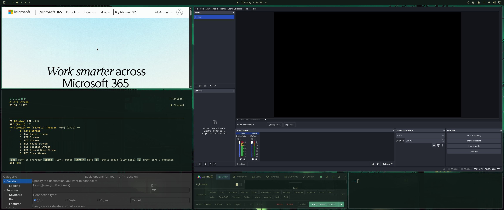

# goldenspiral tiling layout

A custom [Hyprland](https://hypr.land) tiling layout, written in Lua, not a
compiled plugin. The window you're working in is a large **mainstage** on the
centre-right; every other window reflows into a **C** that hugs the mainstage's
left edge and its bottom edge, in roughly golden-ratio (φ ≈ 1.618) proportion.

Opening a window promotes it to the mainstage and pushes other apps one slot
down the C. This is the key departure from dwindle: a new window lands in the
**biggest** tile, not a fresh half-of-a-half. You always get full room to work
in whatever you just opened, and the windows you're not touching are the ones
that shrink. The whole layout recomputes on every add / remove / re-rank, so the
arrangement always reflects the current window order rather than wherever a
split-tree happened to branch.

It's a mix of two of Hyprland's stock layouts. From **master** (specifically
center-master) it takes the idea of one dominant tile that everything else
orbits. From **dwindle** it takes the tree-style recursive
subdivision of the leftover space: the C is the leftover area split down and
then across, the same "keep halving what's left" move dwindle makes, just driven
by an explicit recency order instead of a persistent split tree.



*Six windows: OBS on the mainstage, a left column of three (`2a`/`2b`/`2c`) and a
two-tile bottom strip wrapping it into a C.*

```
+----------+---------------------------+
|  2a      |                           |
+----------+        mainstage (1)      |
|  2b      |                           |
+----------+                           |
|  2c      +---------------------------+
+----------+  3a   |  3b   |  3c  ...  |
+----------+-------+-------+-----------+
     left column          bottom strip
   (C's left stroke)    (C's bottom stroke)
```

- **Slot 1**: mainstage, right ~62 % wide, ~82 % tall.
- **Slots 2a / 2b / 2c**: left column, top to bottom (`2c` is the minimum size).
- **Slots 3a, 3b, …**: bottom strip under the mainstage, equal columns.
  Once a tile would fall below `min_tile_w` the strip wraps into more rows
  (growing upward, shrinking the mainstage) instead of shrinking tiles further.

With 2-4 windows there's no bottom strip: the mainstage runs full height and the
left column stretches to fill.

It ships with a companion **app bar** (`bar/chronobar.py`): a normal window that
the layout recognises by class and pins to a fixed slot in the bottom-right
corner, laying the other windows out around it. See [App bar](#app-bar) below.

See [`docs/DESIGN.md`](docs/DESIGN.md) for the reasoning behind every part of
this.

## Requirements

- Hyprland with the **Lua config system** (0.55+; developed on 0.56.2), which
  provides `hl.layout.register` and the `hl` / `o` config globals. This is what
  [Omarchy](https://omarchy.org) ships. A plain `hyprland.conf` setup would need
  the equivalent Lua entrypoint.
- For the app bar only: **python** with **PyGObject** and **GTK 4**. The layout
  itself has no dependencies; skip the bar and it is still one Lua file.

## Install

```sh
git clone https://github.com/ShakirAkbari/hypr-goldenspiral
cd hypr-goldenspiral
./install.sh
```

`install.sh` symlinks `goldenspiral.lua` into `~/.config/hypr/hypr/`, installs
`bar/chronobar.py` as `~/.local/bin/goldenspiral-bar`, and seeds
`~/.config/goldenspiral/bar.json`. A `git pull` then updates everything in
place.

Then require it **after** whatever sets `general:layout`, so it wins:

```lua
-- ~/.config/hypr/hyprland.lua  (or wherever your requires live)
require("hypr.goldenspiral")
```

```sh
hyprctl reload
hyprctl configerrors   # expect no output
```

The layout registers itself, sets `general.layout = "lua:goldenspiral"`, binds
the controls below, adds a window rule for the bar, and (where `hl.on` is
available) launches `goldenspiral-bar` at session start. Want the layout only?
Just `cp goldenspiral.lua ~/.config/hypr/hypr/` and skip `install.sh`; the bar
launch and window rule no-op when the bar is not running.

## Keybinds

| Key | Action |
| --- | --- |
| `SUPER + M` | promote the focused window to the mainstage |
| `SUPER + CTRL + DOWN` / `UP` | move the focused window down / up the C |
| `SUPER + =` / `-` | widen / narrow the mainstage |
| `SUPER + [` / `]` | grow / shrink the bottom strip |
| `SUPER + 0` | reset proportions |

Controls go through `hl.dsp.layout("<msg>")`. From a shell the equivalent is
`hyprctl dispatch 'hl.dsp.layout("promote")'`; the bare
`hyprctl dispatch layoutmsg promote` form does **not** work on the Lua config.

Available messages: `promote`, `swapnext`, `swapprev`, `grow`, `shrink`,
`taller`, `shorter`, `reset`, `leftfrac <0.2..0.5>`, `dragsnap`, `debug`.

## Drag and drop

Drag a tiled window with `SUPER + left-mouse` (Omarchy's default move bind) and
drop it into one of three zones. It goes to the **front** of that zone, no
finer aim than the zone itself:

| Drop zone | Where the window lands |
| --- | --- |
| **MAIN**: the mainstage (top-right) | the mainstage (rank 1) |
| **SIDE**: the whole left column | top of the left column (`2a`) |
| **BOTTOM**: the strip under the mainstage | the first strip slot |

Everything between the window's old and new rank shifts one step along the C.

Hyprland's Lua layout API exposes no drag or drop event. But a drag *pick-up*
floats the window, so on drop Hyprland hands it back to the layout as a brand
new tile, and any window id the layout has placed before is taken to be a
returning drop rather than a new window. Its drop point (window centre) picks
the zone. A genuinely new window still goes straight to the mainstage.

Turn the whole behaviour off with the `dragsnap` message (a dropped window
then just returns to the mainstage like any new one); `debug` toggles a
notification showing the rank each drop resolved to.

## App bar

`bar/chronobar.py` is a small GTK4 window (app id
`org.goldenspiral.chronobar`). It is not a layer-shell surface: `recalculate`
spots the target with that class, pins it to a fixed slot in the bottom-right
corner (`bar.w_frac` of the work area wide, `bar.h_px` tall), keeps it out of
the C ranking, and lifts the mainstage and bottom strip above it. The left
column stays full height. `install.sh` sets it to launch at session start and
adds a `no_focus` window rule.

It shows two zones, split by a divider:

- **left, recently closed.** An app lands here when its last window closes
  (and it resolves to a desktop entry, so the chip can relaunch it); newest
  close is leftmost. It leaves the instant the app is reopened.
- **right, open now.** One chip per app with a live window, newest nearest the
  corner, with a count badge when an app has more than one window.

| Action | Result |
| --- | --- |
| Left-click a chip | launch a new instance |
| Right-click a right-zone chip | menu of that app's windows; pick one to pull it onto the current workspace and `promote` it to the mainstage |

Config: `~/.config/goldenspiral/bar.json`, hot-reloaded. `barWidthFraction` and
`barHeight` there are also read by the layout so the tile matches what the bar
draws. Other keys: `iconSize`, `gap`, `maxOpen`, `maxClosed`, `showNames`,
`showCounts`, `zoneLabels`, `promoteOnPick`.

## Tuning

Edit the `state` table at the top of `goldenspiral.lua`:

| field | default | meaning |
| --- | --- | --- |
| `left_frac` | `0.382` | left-column width as a fraction of the work area |
| `bottom_frac` | `0.18` | bottom-strip row height as a fraction of the work area |
| `top_split` | `0.41` | height of `2a` and of `2b` (`2c` gets the remainder) |
| `min_tile_w` | `0.16` | bottom-strip tiles never get narrower than this; extra windows wrap to new rows |
| `drag_snap` | `true` | send a dragged-and-dropped window to the front of its drop zone |
| `bar.class` | `org.goldenspiral.chronobar` | window class the layout pins to the corner |
| `bar.w_frac` | `0.3333` | pinned bar width as a fraction of the work area (overridden by `barWidthFraction` in `bar.json`) |
| `bar.h_px` | `150` | pinned bar height in pixels (overridden by `barHeight` in `bar.json`) |

## How it works

`state.order` is an explicit list of window `stable_id`s, `order[1]` being the
mainstage. Each `recalculate`:

1. `ranked(ctx)` reconciles that list with the live targets: prunes closed
   windows, front-inserts genuinely new ones (newest first), sets aside the
   app-bar target (`bar.class`) to pin separately, and parks any *returning*
   window (a known id handed back as fresh, i.e. a drop) at the end for step 3.
2. If the bar is present, `bar_geometry(area)` gives its bottom-right box and
   the carve it implies; `bar_target:place(box)`.
3. `slots(area, n, carve)`, a pure function, returns `n` slot rectangles in
   rank order for the work area, window count, and the bar carve.
4. `place_returning` moves each dropped window to the front of its drop zone
   (`zone_rank` reads the zone from the slot boxes; see
   [Drag and drop](#drag-and-drop)), then `state.order` is re-materialised.
5. each window is placed with `target:place(box)`, which applies gaps, reserved
   area and pseudotiling; every placed id is recorded in `state.seen`.

`layout_msg` mutates `state.order` (`promote` / `swapnext` / `swapprev`) or the
`state` flags and proportions, and returns `true` to trigger a re-layout.

## Tests

`tests/geometry_spec.lua` mocks the config API, loads the layout, and asserts on
the placement logic (ranking, promote, swap, new-window-takes-mainstage,
row-wrap, small-N, and the app-bar pin and carve). Runs under any Lua 5.x:

```sh
lua tests/geometry_spec.lua
```

## Credits

Concept, layout geometry, slot model, recency ranking, the minimum-size /
row-wrap rule and the promote / shuffle interactions are **all designed by
[Shakir Akbari](https://github.com/ShakirAkbari)**. The Lua implementation was written
with Claude Code to Shakir's design.

## License

[MIT](LICENSE) © 2026 Shakir Akbari
